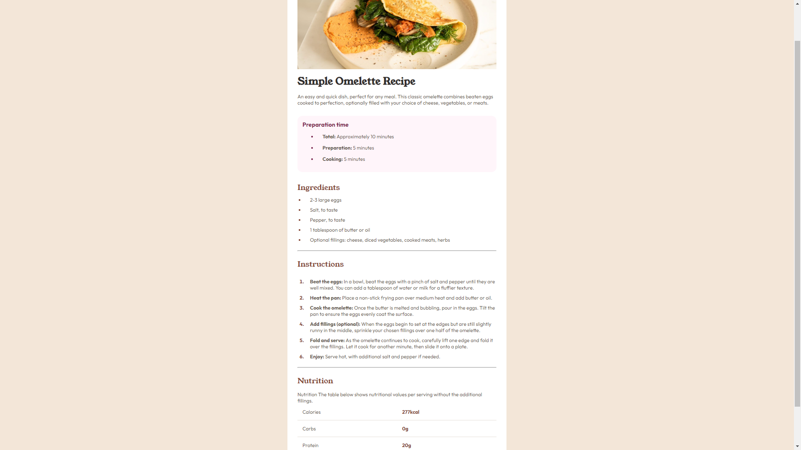
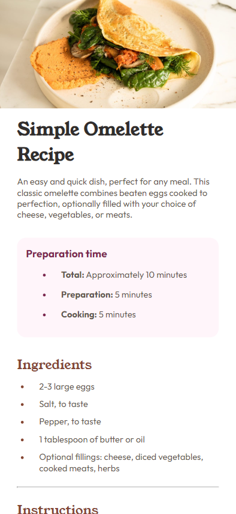

# Frontend Mentor - Social links profile solution

This is a solution to the [Social links profile challenge on Frontend Mentor](https://www.frontendmentor.io/challenges/social-links-profile-UG32l9m6dQ).

## Table of contents

- [Overview](#overview)
  - [Screenshot](#screenshot)
  - [Links](#links)
- [My process](#my-process)
  - [Built with](#built-with)
- [Author](#author)

## Overview

### Screenshot

### Links

- Solution URL: [Add solution URL here](https://github.com/KKajet/ft-social-links-profile)
- Live Site URL: [Add live site URL here]()

## My process

### Built with

- Semantic HTML5 markup
- CSS custom properties
- SASS
- Mobile-first workflow
- Visual Studio Code

## Author

- Frontend Mentor - [KKajet](https://www.frontendmentor.io/profile/KKajet)
