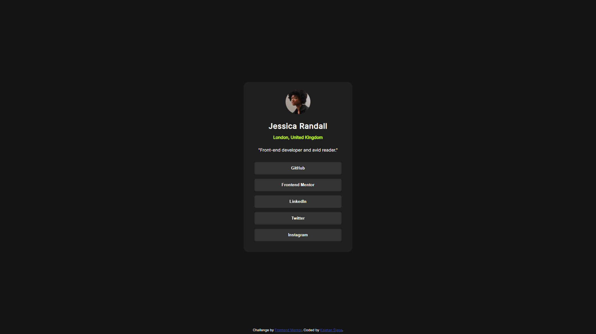
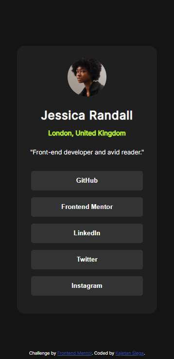

# Frontend Mentor - Social links profile solution

This is a solution to the [Social links profile challenge on Frontend Mentor](https://www.frontendmentor.io/challenges/social-links-profile-UG32l9m6dQ).

## Table of contents

- [Overview](#overview)
  - [The challenge](#the-challenge)
  - [Screenshot](#screenshot)
  - [Links](#links)
- [My process](#my-process)
  - [Built with](#built-with)
  - [What I learned](#what-i-learned)
  - [Useful resources](#useful-resources)
- [Author](#author)

## Overview

### The challenge

Users should be able to:

- See hover and focus states for all interactive elements on the page

### Screenshot

### Links

- Solution URL: [Add solution URL here](https://github.com/KKajet/ft-social-links-profile)
- Live Site URL: [Add live site URL here](https://kkajet.github.io/ft-social-links-profile/)

## My process

### Built with

- Semantic HTML5 markup
- BEM methodology
- CSS custom properties
- SASS
- Mobile-first workflow
- Visual Studio Code

### What I learned

I learned the basics of SASS

### Useful resources

- [Example resource 1](https://youtu.be/Y3io4_cudPg) - This helped me with SASS.

## Author

- Frontend Mentor - [KKajet](https://www.frontendmentor.io/profile/KKajet)
